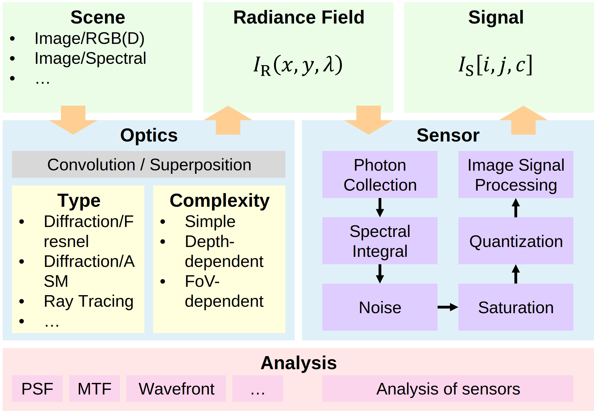

# DNOIS: Differentiable Numeric Optical Imaging Simulation

> :bangbang: This project is under active development. Its content is subject to change.

## Introduction


## Features
- Provides precise, standard, efficient and usable implementation for imaging simulation
- Covers the whole imaging pipeline in computational photography/imaging,
  from representation of scenes to output signal of simulated sensor.
- Simulates imaging in a differentiable manner, enabling end-to-end optimization.
- Supports diverse application scenarios and flexible options of optical systems.

## Documentation
An online documentation of DNOIS is available [here](https://gjqaq.github.io/dnois/).

## Usage

### Packaging
```shell
python -m build
```

### Build documentation
```shell
cd docs
make html
```
